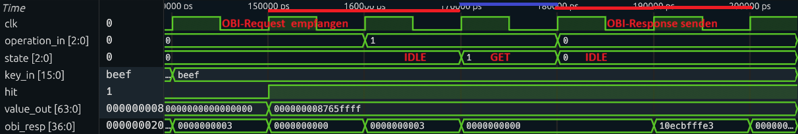
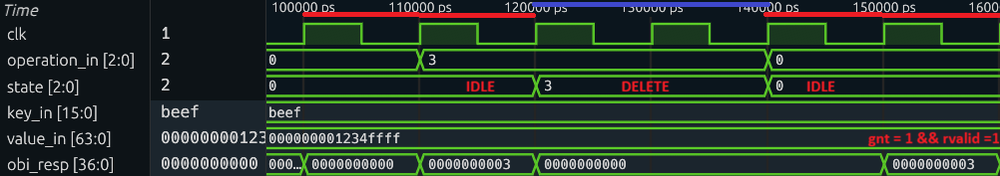

# Architektur

Nachfolgendes Diagramm gibt einen Überblick über die Gesamtarchitektur unseres Redis Caches und zeigt die Verbindungen zwischen den einzelnen Modulen, auf die in den folgenden Abschnitten näher eingegangen wird.

Dabei ist unsere Cache Hardware in die CROC Architektur eingebettet. Die CROC_DOMAIN wird im Kapitel [CROC](#croc) beschrieben. Die USER_DOMAIN ist modular aufgebaut und in drei Hauptkomponenten unterteilt:

1.  **OBI Interface (`obi_interface`)**: 
    Dieses Modul fungiert als Slave am OBI-Bus. Es nimmt Anfragen entgegen und verwaltet die internen Register für Key, Value und Control-Signale. Es entkoppelt das Bus-Protokoll von der internen Logik.

2.  **Controller (`controller`)**: 
    Die zentrale Steuereinheit (Orchestrator). Sie liest die Control-Register, interpretiert die Befehle (GET, UPSERT, DELETE) und steuert die Schreib-/Lese-Signale des Speichers. Die Ausführung komplexer Abläufe delegiert der Controller an spezialisierte Sub-FSMs (siehe [Implementation](#implementationen)).

3.  **Memory Block (`memory_block`)**: 
    Enthält das eigentliche Speicher-Array. Die Daten (Key/Value) liegen direkt aus den Interface-Registern am Speicher an.

## Statemachine
Zu Beginn des Projekts wurde die State Machine mit einem stark sequenziellen Ansatz entworfen, ähnlich einem Software-Ablaufplan.
Dabei wurden komplexe Operationen wie UPSERT in viele nacheinander ablaufende Sub-States unterteilt.

Dieser Ansatz hätte Lese- und Schreiboperationen künstlich über mehrere Taktzyklen gestreckt, da in jedem Taktzyklus nur eine einzige Bedingung evaluiert wurde.

Während der Implementierung zeigte sich, dass durch die Hardware-Parallelität Signale kontinuierlich anliegen und die Bedingungen gleichzeitig (kombinatorisch) geprüft werden können. 
Somit konnten wir die Statemachine deutlich verkleinern und auf nur einen Zyklus pro Operation verkürzen.

*Hinweis: Aus Zeitgründen wurde die DELETE Operation noch nicht auf das optimierte Konzept umgestellt und entspricht noch dem initialen, sequenziellen Ansatz.*

## Taktzyklus Beispiele

Basierend auf der ursprünglichen Statemachine haben wir zur effizienteren Verarbeitung  geplant, im Controller auf positive und im Memory Block auf negative Taktflanken zu warten.
Dies sollte ermöglichen, Lese- und Schreiboperationen innerhalb einer Taktperiode abzuschließen.
Folgendes Diagramm zeigt die daraus resultierenden Taktflanken.

Mithilde der Python-Tests (Cocotb) konnten die tatsächlichen Taktzyklen nach der Implementierung dargestellt werden. Siehe Kapitel [Tests](#tests)

