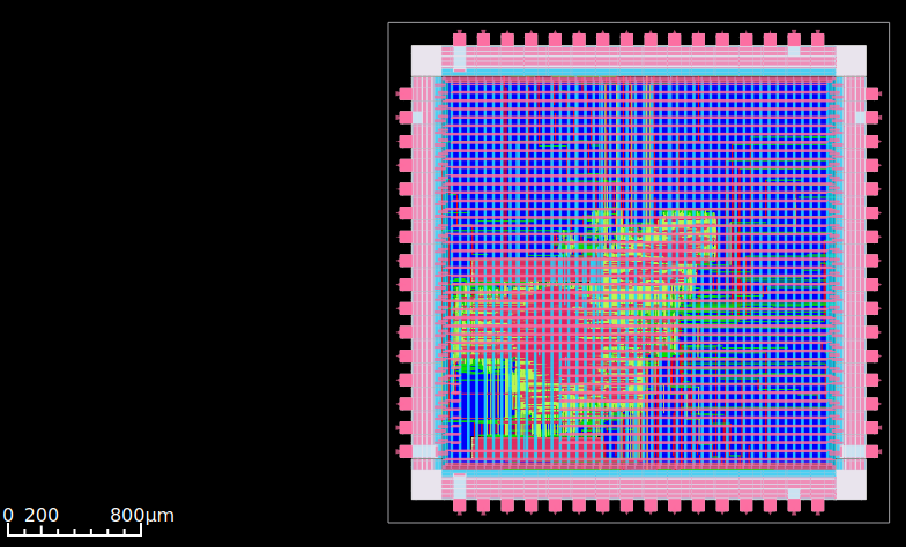

# Backend
Philipp Hecht

Wie bereits erwähnt wurden wie in dem gezeigtem Beispielprojektes mit Submodulen gearbeitet, was es uns ermöglichte die einzelnen Komponenten (Memory Block, Cache Controller, OBI Interface) unabhängig voneinander zu entwickeln und zu testen. In diesem Kapitel soll es darüber hinausgehend auf das Bauen der einzelnen Module sowie das 
Ausführen der gesamten Backend Pipeline eingegangen werden. 

## Librelane Pipelines

Ein weiterer Vorteil der gesamten Modularisierung der Komponenten war die Möglichkeit, die einzelnen Module unabhängig voneinander zu bauen. Hierfür wurden
in ähnlicher Weise wie vom Lehrpersonal bereitgestellt, *Makefile Targets* für das ausführen der Librelane Pipeline erstellt. Jedes Target baut ausgehend von einer
`config.yaml` Datei die entsprechende Komponente. Auf unterster Ebene werden die jeweiligen Targets rekursiv aufgerufen: 

Darüber hinaus wurde für das Tapeout des gesamten Systemes (inklusive der Croc Umgebung) auf Empfehlung des Lehrpersonals 
ein weiteres Code Repository erstellt. Diese beinhaltet die gesamte Croc Umgebung, die Anbindung an unser System sowie 
unsere eigene Implementierung (vgl. Kapitel [CROC](#croc)). 

Das Croc Repository arbeitet zum Tapeout ihrer Implementierung mit [Bender](https://github.com/pulp-platform/bender). Zur Transition zur unserer eigenen Tapeout Pipeline 
wurde zunächst versucht, über die Bender Pipeline eine vollumfängliche Liste aller notwendigen Verilog Dateien zu generieren. Die Idee war, diese in einer Librelane
Konfigurationsdatei zu überführen um, darauf aufbauend, den gesamten SoC über die vom Lehrpersonal vorgestellten Tools zu bauen. 

Nach mehreren gescheiterten Versuchen und Rücksprache mit dem Lehrpersonal wurden wir auf einen bereits existierenden Fork des Projektes verwiesen, welcher die Überführung uns abnimmt. Mit diesem Fork begannen wir das Tapeout Repository neu aufzusetzen und unsere Änderungen einzupflegen. 

Aus zeitlichen Gründen durch Nahekommen der Abgabe konnten wir allerdings die komplette Transistion und Anpassung unserer Makefile Targets nicht mehr durchführen und testen. 
Stattdessen wurde nur ein Bau Prozess gestartet, welches nicht mit Makros arbeitet, sondern alle Verilog Dateien zusammen kompiliert. 

Nach dem erfolgreichen Bau des gesamten Systems, konnten wir uns zuletzt das Endergebnis unserer Implementierung anschauen. Nachfolgende Abbildung zeigt die generierte GDSII Datei: 

Zu sehen ist, wie wenig Platz unsere Implementierung auf dem vorgesehenen 3mm - 3mm Chip einnimmt. Da dies nur der initelle Test für die 
Tapeout Pipeline war, zeigte uns dies, dass wir die Anzahl an Speicherzellen deutlich erhöhen können. In einem nächsten Schritt erweiterten 
wir die Anzahl an Speicherzellen von Standardmäßig 16 Zellen auf 1024 Zellen. Hierfür wurde lediglich die Konfigurationsdatei `cache_cfg_pkg.sv` angepasst. 