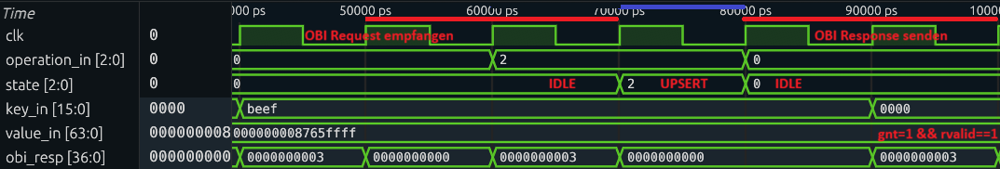

# Tests

Ausarbeitung Luca Schmid

## Allgemeines Testkonzept

Um die korrekte Funktionalität der Module sicherzustellen, haben wir Frontend-Tests mittels **Cocotb** (Coroutine Co-simulation Testbench) durchgeführt. Die Tests gliedern sich in zwei Ebenen:

1.  **Unit-Tests:** Überprüfung einzelner Module (z.B. `memory_block`, `dynamic_register_array`)
2.  **End-to-End Tests:** Überprüfung des Gesamtsystems (`redis_cache`) über das OBI-Interface

Als Simulatoren kommen **Verilator** und **Icarus Verilog** zum Einsatz. Bei den Unit-Tests auf Modul-Ebene ohne komplexe SystemVerilog-Structs konnte Icarus Verilog verwendet werden. Für den End-to-End Test auf der Top-Ebene wurde aufgrund der integrierten OBI-Packages und Structs der Simulator Verilator benötigt.

## Unit-Tests

Bevor das Gesamtsystem getestet wurde, wurden die einzelnen Module wie Controller, Interface und Speicherkomponenten einzeln getestet. Beispielsweise prüft der Test `test_memory_block.py` die direkte Ansteuerung des Speichers ohne den Overhead des OBI-Protokolls.

Hierbei werden Szenarien abgedeckt wie:
- Schreiben und Lesen von Key-Value Paaren.
- Verhalten bei vollem Speicher (`used_entries`).
- Löschen von Einträgen und Überprüfung der Persistenz nicht gelöschter Daten.
- Überschreiben bestehender Einträge.

## End-to-End Test (`test_redis_cache.py`)

Der zentrale Bestandteil der Verifikation ist der Integrationstest `test_redis_cache.py`, welcher das Top-Level-Modul `redis_cache` instanziiert (in dem alle Sub-Komponenten (`obi_interface`, `controller`, `memory_block`) miteinander verbunden sind).

### Funktionsweise

Dieser Test simuliert die Sicht eines externen Masters (z.B. einer CPU). Es werden ausschließlich Daten über das OBI-Interface verschickt und empfangen. 

1.  **Daten schreiben:** Key und Value werden an die entsprechenden Register-Adressen des Interfaces gesendet.
2.  **Kommando senden:** Der Opcode (GET, UPSERT, DELETE) wird in das Control-Register geschrieben.
3.  **Warten:** Die Testbench wartet, bis der Controller die Operation verarbeitet hat und das gnt Signal zurück schickt.
4.  **Verifikation:** Das Ergebnis (z.B. gelesene Daten oder Status-Bits) wird überprüft.

### Code-Beispiel: Ausführen einer Operation

Die Hilfsfunktion `execute_cache_operation` in der Testbench mapped die Daten in die entsprechenden Register-Adressen, bevor sie versendet werden:

```python
async def execute_cache_operation(dut, tester, operation, key, value=0):

    # 1. Value Register schreiben (nur bei UPSERT nötig)
    if operation == 'UPSERT':
        await obi_write(dut, addr=0, wdata=value)
        
    # 2. Key Register schreiben (Adresse 8)
    await obi_write(dut, addr=8, wdata=key)
    
    # 3. Kommando im Control-Register absetzen (Adresse 12)
    await obi_write(dut, addr=12, wdata=(op_code << 1), be=1)
    
    # 4. Warten bis Controller fertig ist (Polling auf State 0/IDLE)
    while int(tester.u_ctrl.state.value) != 0:
    await tester.wait_cycles(1)
```

Die Hilfsfunktion `obi_write` erstellt die OBI Nachricht und führt den Handshake durch.

```python
async def obi_write(dut, addr, wdata, be=0xF):
    dut.obi_req_i.value = pack_obi_req(addr=addr, we=1, be=be, wdata=wdata, req=1)

    # Warten auf das Grant-Signal (Handshake)
    while True:
        await RisingEdge(dut.clk)
        resp_val = int(dut.obi_resp_o.value)
        gnt_bit = (resp_val >> 1) & 1 
        if gnt_bit == 1:
            break
            
    # Request wieder auf 0 ziehen
    dut.obi_req_i.value = pack_obi_req()
    await RisingEdge(dut.clk)

```

### Analyse

Die während der Tests aufgezeichneten Signale werden aufgezeichnet und können im Nachgang analysiert werden.
Die folgende Grafik zeigt die aufgezeichneten Signale eines `UPSERT` in einen leeren Cache.
In der Zeile `operation_in` ist zu sehen, welche Operation vom Controller empfangen wird.
Im darauffolgenden Takt wechselt der Controller in den entsprechenden Zustand.
Nach dem einfügen des Keys in den Speicher wechselt der Controller zurück in den IDLE Status.
Gleichzeitig sendet das OBI-Interface die Response. 
Der Wert `3` der OBI-Response bedeutet, dass das GNT und rvalid Bit gesetzt sind (Siehe Kapitel [OBI](#obi)) und die Operation erfolgreich durchgeführt wurde. 


